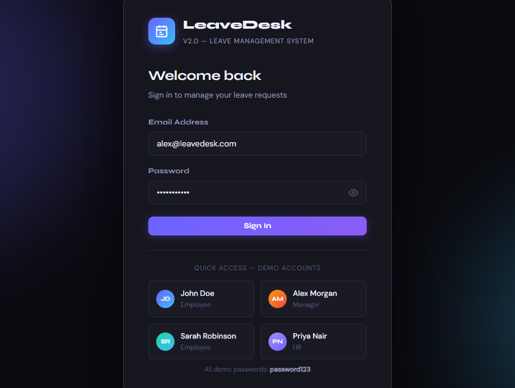
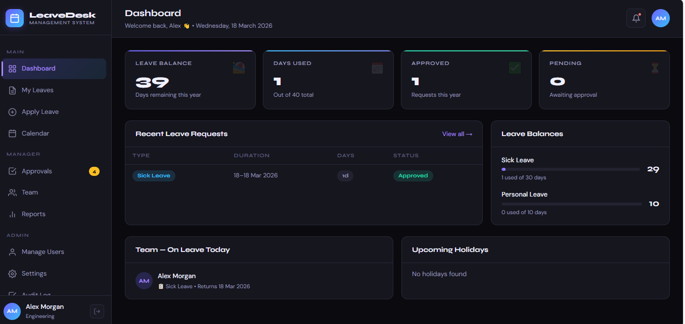
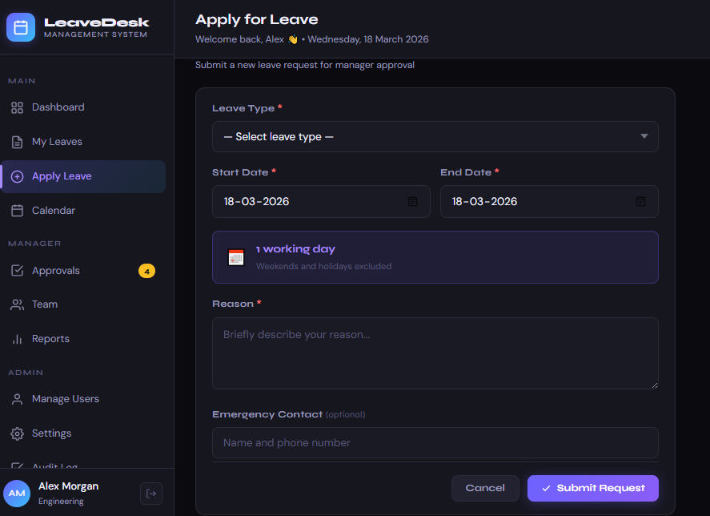
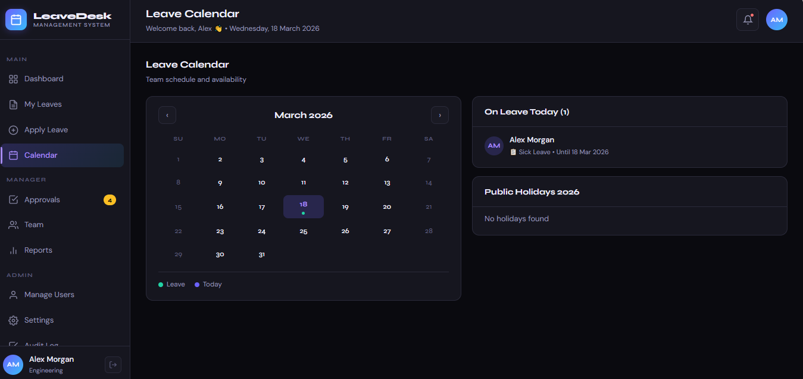
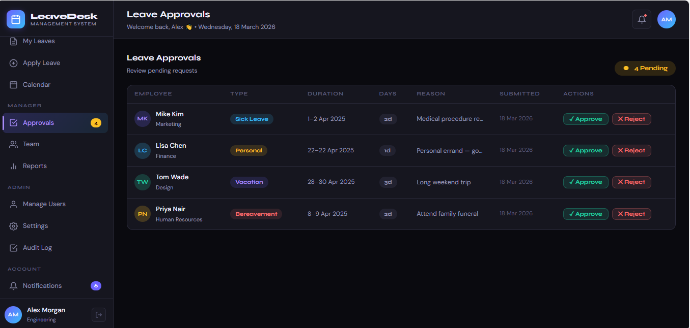
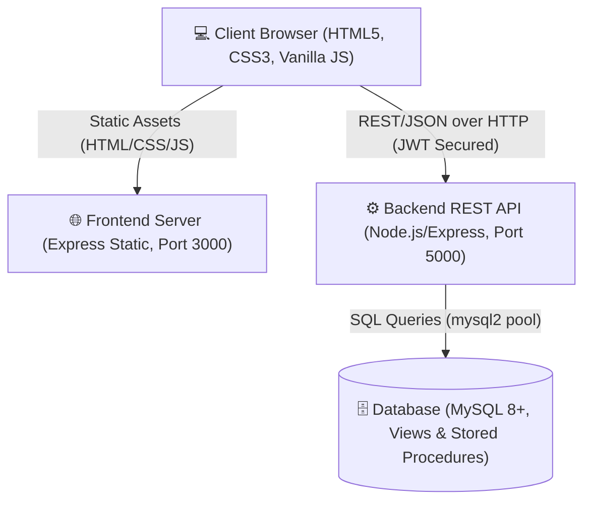

# 🏢 LeaveDesk v2.0 — Enterprise Leave Management System

<div align="center">
  <h3>A Full-Stack Employee Leave Management Application built for performance, scale, and seamless user experience.</h3>
</div>

---

## 📖 Table of Contents
- [Overview](#-overview)
- [System Architecture](#-system-architecture)
- [Tech Stack](#-tech-stack)
- [Key Features](#-key-features)
- [Database Schema & Stored Procedures](#-database-schema--stored-procedures)
- [Getting Started (Local Setup)](#-getting-started-local-setup)
- [Project Structure](#-project-structure)
- [API Reference](#-api-reference)
- [Demo Credentials](#-demo-credentials)
- [Future Roadmap](#-future-roadmap)

---

## 🌟 Overview

**LeaveDesk v2.0** is an enterprise-grade web application designed to streamline the process of requesting, tracking, and approving employee leave. It provides distinct interfaces and role-based access for typical **Employees** and **Managers/Admins**, facilitating transparent and efficient human resource management. 

By separating the API backend (Node.js/Express) from the client-side presentation, the system is decoupled and highly scalable, relying on a robust **MySQL** relational database leveraging advanced features like stored procedures, views, and index optimization.

### 📸 Application Screenshots

Here is a glimpse of the LeaveDesk v2.0 user interface:


*Employee Dashboard providing an overview of leave balances and recent activity.*


*Intuitive interface for submitting new leave requests and viewing history.*


*Dedicated queue for managers to review, approve, or reject team requests.*


*Visual calendar displaying team availability and upcoming public holidays.*


*Visual analytics, reporting tools, and system administrative settings.*

---

## 🏗️ System Architecture

LeaveDesk follows a modern, decoupled **Three-Tier Architecture** that cleanly separates the client, server APIs, and the relational data store.



### Architectural Decisions & Trade-offs
1. **Vanilla JS Frontend**: Purposefully built without heavyweight frameworks (like React or Angular) to maintain an ultra-lightweight client-side footprint while maximizing direct DOM manipulation performance. 
2. **REST API Separation**: Enables future expansions to mobile apps by decoupling the UI from data operations.
3. **Database Offloading**: Heavy computation (like calculating remaining leave balances and approving requests) is offloaded to MySQL using **Stored Procedures** and **Views**, reducing Node.js memory overhead.

---

## 💻 Tech Stack

### Frontend (Client-Side)
- **HTML5 & CSS3**: Responsive, native styling featuring semantic layouts.
- **Vanilla JavaScript (ES6+)**: Handles dynamic routing, DOM updates, and API interactions.
- **Express Static Server**: Serves frontend assets on port `3000`.

### Backend (API Server)
- **Node.js**: Asynchronous JavaScript runtime.
- **Express.js**: Fast, unopinionated web framework handling API routes on port `5000`.
- **JSON Web Tokens (JWT)**: Secure, stateless user authentication and role-based authorization.
- **bcryptjs**: Cryptographic password hashing.

### Database
- **MySQL (v8.0+)**: Primary relational data store.
- **Stored Procedures**: Encapsulates atomic business logic.

---

## ✨ Key Features

### 👤 Employee Dashboard
* **Secure Authentication**: JWT-based login, persistent sessions, and secure password updates.
* **Live Statistics:** At-a-glance visualization of total vs. used leave balances.
* **Leave Application**: Apply for various leaves (Vacation, Sick, etc.) with automatic calculation of actual working days excluding weekends/holidays.
* **Overlap Protection**: Prevents duplicate requests for the same dates.
* **Leave History**: Comprehensive view of past requests with the ability to cancel pending ones.
* **Team Calendar**: Visual timeline of team availability and upcoming public holidays.
* **Notifications**: Real-time alerts regarding approval statuses.

### 👔 Manager & Admin Operations
* **Approval Queue**: Dedicated view to quickly review, approve, or reject pending leave requests with accompanying comments.
* **Team Overview**: Comprehensive lists displaying active employees and their respective leave balances across all types.
* **Analytics & Reports**: Visual charts breaking down leave statuses and monthly trends.
* **User Management**: Add new employees, assign departments/managers, modify roles, or deactivate users.
* **System Settings**: Dynamically update global settings such as Leave Policies, Departments, and Public Holidays.
* **Audit Logs**: Irrefutable history tracking system transactions.

---

## 🗄️ Database Schema & Stored Procedures

The backend relies on a highly normalized relational database to ensure data integrity and query speed.

- **Tables**: `users`, `departments`, `leave_types`, `leave_balances`, `leave_requests`, `holidays`
- **Stored Procedures**: 
  - `approve_leave`: Atomically updates request status and correspondingly deducts leave balances.
  - `reject_leave`: Atomically Rejects the leave request.
- **Views**: 
  - `v_leave_summary`: Pre-computed aggregation of user leave allocations.
  - `v_pending_requests`: Optimized queue for managers.
- **Indexes**: Applied efficiently to `status`, `dates`, and `user_id` fields for lightning-fast lookups.

---

## 🚀 Getting Started (Local Setup)

Follow these steps exactly to run the project locally. 

### Prerequisites
- Node.js (v16+)
- MySQL (v8.0+) installed and running

### Step 1 — Database Initialization
Open your terminal or MySQL Workbench and run the database script to create the tables, seed data, and stored procedures:
```bash
mysql -u root -p < database.sql
```

### Step 2 — Backend Configuration & Startup
Open a terminal, navigate into the backend directory, and install dependencies:
```bash
cd backend
npm install
```
Configure your environment variables by copying the example file:
```bash
cp .env.example .env
```
Open `.env` and configure your database credentials (specifically `DB_PASSWORD`):
```env
PORT=5000
NODE_ENV=development
DB_HOST=localhost
DB_PORT=3306
DB_USER=root
DB_PASSWORD=your_mysql_password_here
DB_NAME=leavedesk
JWT_SECRET=your_super_secret_key
JWT_EXPIRES_IN=7d
FRONTEND_URL=http://localhost:3000
```
Start the backend API server:
```bash
npm start
```
> **Backend runs at:** `http://localhost:5000`

### Step 3 — Frontend Startup
Open a **new, split terminal**, navigate to the frontend directory, and run the static server:
```bash
cd frontend
npm install
npm start
```
> **Frontend runs at:** `http://localhost:3000`

Finally, open your preferred web browser and navigate to **`http://localhost:3000`**.

---

## 🔑 Demo Credentials

A seed database script automatically populates several test accounts. All passwords are set to `password123`.

| Name            | Email                   | Role     |
|-----------------|-------------------------|----------|
| **Alex Morgan** | `alex@leavedesk.com`    | Manager  |
| **John Doe**    | `john@leavedesk.com`    | Employee |
| **Sarah Robinson**| `sarah@leavedesk.com` | Employee |
| **Priya Nair**  | `priya@leavedesk.com`   | Employee |

---

## 📂 Project Structure

```text
leavedesk-fullstack/
├── database.sql           # Database schema, procedures, views, and seed data
├── README.md              # Project documentation
│
├── frontend/              # Client-side Application
│   ├── server.js          # Express static file server (port 3000)
│   ├── package.json       
│   ├── index.html         # Main SPA entry point
│   ├── css/
│   │   ├── main.css       # Global styles and layout
│   │   └── components.css # Component-specific styling (modals, cards, tables)
│   └── js/
│       ├── api.js         # Centralized API fetch wrapper and interceptors
│       ├── utils.js       # Core utilities, JWT routing, login/logout logic
│       ├── pages.js       # Employee views (Dashboard, Calendar, Reports)
│       └── pages-admin.js # Manager/Admin views (Approvals, Settings, Audit)
│
└── backend/               # REST API Server
    ├── server.js          # Express API initialization (port 5000)
    ├── package.json       
    ├── .env               # Environment configuration
    ├── config/
    │   └── db.js          # MySQL connection pool configuration
    ├── middleware/
    │   └── auth.js        # JWT verification and Role-based Access Control (RBAC)
    └── routes/            # API Route Controllers
        ├── auth.js        # Registration, login, password updates
        ├── leaves.js      # Leave requests and approvals
        ├── users.js       # User profiles and balance queries
        ├── admin.js       # Administrative endpoints (user management, audit)
        └── notifications.js # System alerts and notification fetching
```

---

## 🔌 API Reference

The backend exposes the following RESTful endpoints (Base URL: `http://localhost:5000`):

| Method | Endpoint | Description | Access |
|--------|----------|-------------|--------|
| **POST** | `/api/auth/login` | Authenticate and retrieve JWT | Public |
| **GET**  | `/api/auth/me` | Retrieve the currently authenticated user | Protected |
| **POST** | `/api/auth/change-password` | Update user password | Protected |
| **GET**  | `/api/leaves` | Fetch the authenticated user's leave requests | Protected |
| **POST** | `/api/leaves` | Submit a new leave request | Protected |
| **PUT**  | `/api/leaves/:id/approve` | Approve a pending leave request | **Manager** |
| **PUT**  | `/api/leaves/:id/reject` | Reject a pending leave request | **Manager** |
| **GET**  | `/api/users/balances` | Retrieve the authenticated user's leave balances | Protected |
| **GET**  | `/api/users/team` | Fetch team member details and overview | Protected |
| **GET**  | `/api/users/reports` | Retrieve visual analytics data | Protected |
| **GET**  | `/api/admin/users` | Retrieve list of all users | **Manager** |
| **GET**  | `/api/admin/audit` | Retrieve complete system audit logs | **Manager** |
| **GET**  | `/api/notifications` | Fetch unread and read notifications | Protected |

---

## 🔮 Future Roadmap

- [ ] **Email Notifications**: Integration with SendGrid/Nodemailer for real-time leave status alerts.
- [ ] **Slack/Teams Integration**: Automated Webhooks for cross-platform team visibility.
- [ ] **Mobile Optimization**: PWA implementation for better mobile user experience.
- [ ] **Advanced Authentication**: OAuth 2.0 Integration (Google/Microsoft Sign-in).
